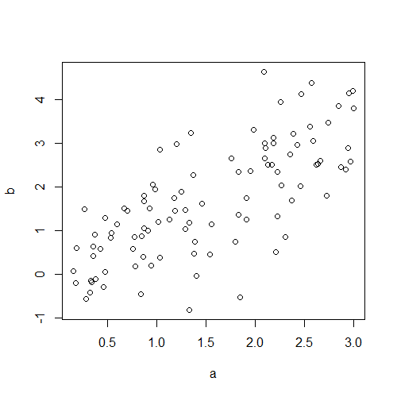

# covBagging
### Spatial covariance weighting for bagging models in R

This package provides functions and scripts that were used to perform the simulations presented in the manuscript, *Improved prediction and validation of bagging models with spatially clustered sample data*.

## Installation

You can use the `remotes` package to install the package directly from github. Install `remotes` first if you do not have it. 

```
install.packages("remotes")
remotes::install_github("benjaminmisiuk/covBagging")
```

## Loading functions
The functions can then be loaded into your R environment.

```
library(covBagging)
help(package = 'covBagging')
```

Below is an example for calculating the weighted variance explained:

```
#generate random data
a <- runif(100, 0, 3)

#simulate a linear dependent covariate with noise
b <- a + rnorm(100)
plot(a, b)
```



```
#check unweighted VE
ve(a, b)
#[1] 0.5159723

#generate random vector of weights
wt = runif(100)

#return weighted VE
ve_wt(a, b, wt)
#[1] 0.5071803
```

## Simulation scripts
Scripts used to perform the simulations for each validation method are provided in the directory "covBagging\scripts". Suggest opening the script in R to load in custom data and view code annotations.
