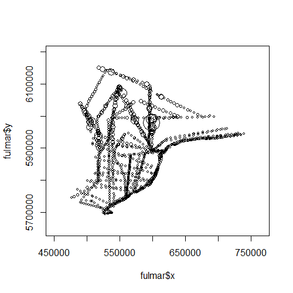
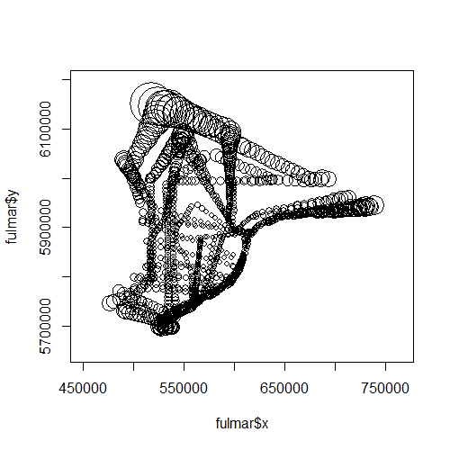
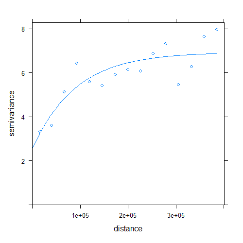

# covWt
### Spatial covariance weighting in R

This package provides functionality and scripts that were used to perform residual covariance-weighted bagging and validation as presented in the manuscript, *Improved environmental mapping and validation using bagging models with spatially clustered data*. 

Code used to perform the simulations presented in the study are found in the "covWt\scripts" directory. Suggest opening the script in R to load in custom data and view code annotations.

## Installation
You can use the `remotes` package to install the package directly from github. Install `remotes` first if you do not have it. 

```
install.packages("remotes")
remotes::install_github("benjaminmisiuk/covWt")
```

## Loading functions
The functions can then be loaded into your R environment.

```
library(covWt)
help(package = 'covWt')
```

## Examples
### Covariance-weighted validation
Residual covariance weighting can be used to penalize the contribution of clustered sample sites to geospatial map validation statistics. We can look at an example using data from the `gstat` package, which also provides functionality for calculating variograms. We will use Random Forest models to predict the density of fulmar birds given some environmental data, as presented by [Pebesma _et al_. (2005)](https://doi.org/10.1002/env.723).
```
library(gstat)
library(randomForest)

data("fulmar")
```
We can take a look at the data and plot the fulmar density observations in space:
```
head(fulmar)
symbols(x = fulmar$x, y = fulmar$y, circles = fulmar$fulmar+7, inches = 0.15)
```
```
#  year        x       y depth    coast fulmar
#1 1998 614192.3 5875490     6 3.445307      0
#4 1998 613150.8 5872947     6 3.445307      0
#5 1998 619644.7 5888800     9 3.042531      0
#6 1998 608858.6 5839623    16 3.845921      0
#7 1998 556583.0 5738519     1 2.701462      0
#8 1998 553423.7 5735916     3 1.807041      0
```


Some of the data are quite clustered. Let's try training a Random Forest model to predict the fulmar density given the covariates in the dataset.
```
rf <- randomForest(fulmar ~ ., data = fulmar)

#get the out-of-bag predictions
p <- predict(rf)
```
We can validate the model by comparing the "out-of-bag" predictions to the observed values:
```
#the root mean squared error
rmse(fulmar$fulmar, p)

#the variance explained
ve(fulmar$fulmar, p)
```
```
#[1] 2.359215
#[1] 0.3834001
```
Not bad, but we know from the literature that clustered data may result in inflated estimates of predictive accuracy when validated using traditional designs, such as 10-fold cross-validation, or the "out-of-bag" validation from Random Forest. One solution is to penalize the influence of clustered points using the autocorrelation of the prediction errors - namely, the covariance.

First we calculate the out-of-bag residuals for each location:
```
res <- data.frame(
  x = fulmar$x,
  y = fulmar$y,
  res = fulmar$fulmar - p
)
```
Then look at the variogram to estimate spatial autocorrelation of the errors using the `gstat` package:
```
v <- variogram(object = res~1, locations = ~x+y, data = res, cutoff = 400000)

#try fitting an exponential model
fit <- fit.variogram(v, model = vgm("Exp"))
plot(v, fit)
```


There is a decent exponential fit, showing substantial autocorrelation of model errors in space. We can use the spatial autocorrelation decay and the sample clustering to down-weight the clustered observations for the validation. We just need the variogram model and the distance matrix between observations.
```
#calculate the distance matrix between observations
d = dist(fulmar[ ,c("x", "y")])

#calculate covariance weights using the fitted residual variogram model
wt <- covWt(dmat = d, model = fit)

#plot the weights spatially
symbols(x = fulmar$x, y = fulmar$y, circles = wt-min(wt)+0.1, inches = 0.25)
```


We can see that the clustered data points are assigned smaller weight. Let's recalculate the **weighted** validation statistics and compare to the original **un-weighted** ones.
```
rmse(fulmar$fulmar, p)
rmse_wt(fulmar$fulmar, p, wt)
```
```
#[1] 2.359215
#[1] 2.507958
```
```
ve(fulmar$fulmar, p)
ve_wt(fulmar$fulmar, p, wt)
```
```
#[1] 0.3834001
#[1] 0.3728367
```
The weighted statistics indicate slightly lower performance than the un-weighted estimates.

### Covariance-weighted bagging
We also know that clustered data can bias model training. We can try to use the covariance weights to decrease the influence of the clustered data on the model fit. Specifying the `weight` argument of `randomForest()` allows for decreasing the probability that the clustered samples are drawn during bootstrapping. Correcting for bias in this way is known as the _inverse probability bootstrap_ ([Nahorniak _et al_. 2015](https://journals.plos.org/plosone/article?id=10.1371/journal.pone.0131765)).
```
#use covariance weights for bagging with random forest
rf <- randomForest(fulmar ~ ., data = fulmar, weights = wt)

#get the new out-of-bag predictions
p <- predict(rf)
res <- data.frame(
  x = fulmar$x,
  y = fulmar$y,
  res = fulmar$fulmar - p
)

#fit the variogram model
v <- variogram(object = res~1, locations = ~x+y, data = res, cutoff = 400000)
fit <- fit.variogram(v, model = vgm("Exp"))
plot(v, fit)
```


```
#re-calculate covariance weights using the new model residuals
wt <- covWt(dmat = d, model = fit)

#calculated covariance-weighted statistics
rmse_wt(fulmar$fulmar, p, wt)
ve_wt(fulmar$fulmar, p, wt)
```
```
#[1] 2.515283
#[1] 0.3698575
```
In this case, we don't see much change using the bagging weights.

# References
Nahorniak, M., Larsen, D.P., Volk, C., Jordan, C.E., 2015. Using Inverse Probability Bootstrap Sampling to Eliminate Sample Induced Bias in Model Based Analysis of Unequal Probability Samples. PLOS ONE 10, e0131765. https://doi.org/10.1371/journal.pone.0131765

Pebesma, E.J., 2004. Multivariable geostatistics in S: the gstat package. Computers & Geosciences 30, 683–691. https://doi.org/10.1016/j.cageo.2004.03.012

Pebesma, E.J., Duin, R.N.M., Burrough, P.A., 2005. Mapping sea bird densities over the North Sea: spatially aggregated estimates and temporal changes. Environmetrics 16, 573–587. https://doi.org/10.1002/env.723
